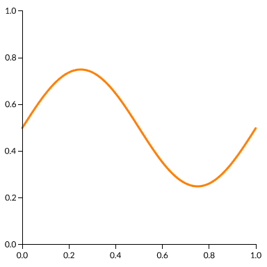

<h1 align="center">
  CandyGraph
</h1>

<div align="center">
  A flexible and fast-by-default 2D plotting library tuned for rendering huge datasets on the GPU at interactive speeds.
</div>

<div align="center">
  <h3 align="center">
    <a href="https://wwwtyro.github.io/candygraph/tutorial/dist/">Tutorial</a> |
    <a href="https://wwwtyro.github.io/candygraph/examples/dist/">Examples</a> |
    <a href="https://github.com/wwwtyro/candygraph/blob/master/docs/API.md">API Docs</a>
  </h3>
</div>

- Adopts D3's elegant concept of scales, but implements them on the GPU to maximize data throughput and handle scale changes with no additional cost.
- Performs all rendering on the GPU, even axes and text. This keeps rendering and compositing fast and simple - no need to overlay a canvas or svg over your plot.
- Provides a small but growing set of highly optimized primitives that are tuned for handling huge datasets.
- Provides a set of higher-level composite objects composed of primitives to simplify common rendering tasks.

> CandyGraph is still in [major version zero](https://semver.org/#spec-item-4); the API should be considered unstable.

## Example

<p align="center">
  
</p>

```ts
import { createCandyGraph } from "candygraph";

// Create the CandyGraph context, set its canvas size, and append it to the document.
const cg = await createCandyGraph();
cg.canvas.width = cg.canvas.height = 384;
document.body.appendChild(cg.canvas);

// Generate some x & y data.
const xs = [];
const ys = [];
for (let x = 0; x <= 1; x += 0.001) {
  xs.push(x);
  ys.push(0.5 + 0.25 * Math.sin(x * 2 * Math.PI));
}

// Create a viewport. Units are in pixels.
const viewport = { x: 0, y: 0, width: 384, height: 384 };

// Create a coordinate system from two linear scales. Note
// that we add 32 pixels of padding to the left and bottom
// of the viewport, and 16 pixels to the top and right.
const coords = cg.coordinate.cartesian(
  cg.scale.linear([0, 1], [32, viewport.width - 16]),
  cg.scale.linear([0, 1], [32, viewport.height - 16])
);

// Clear the viewport.
cg.clear([1, 1, 1, 1]);

// Render the a line strip representing the x & y data, and axes.
cg.render(coords, viewport, [
  cg.lineStrip(xs, ys, {
    colors: [1, 0.5, 0.0, 1.0],
    widths: 3,
  }),
  cg.orthoAxis(coords, "x", {
    labelSide: 1,
    tickOffset: -3,
    tickLength: 6,
    tickStep: 0.2,
    labelFormatter: (n) => n.toFixed(1),
  }),
  cg.orthoAxis(coords, "y", {
    tickOffset: 3,
    tickLength: 6,
    tickStep: 0.2,
    labelFormatter: (n) => n.toFixed(1),
  }),
]);
```
